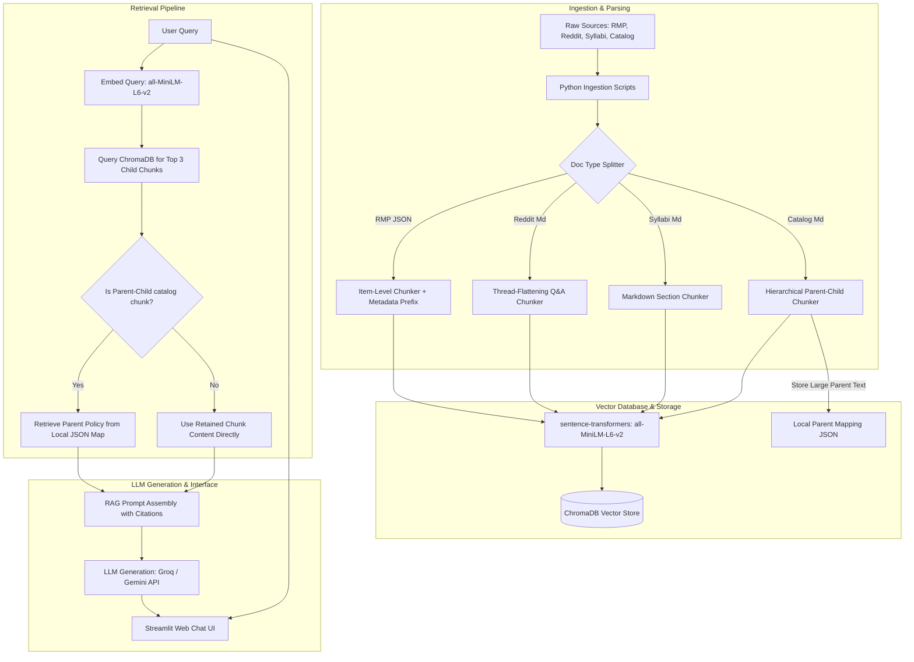

# Project 1 Planning: The Unofficial Guide

> Write this document before you write any pipeline code.
> Your spec and architecture diagram are what you'll use to direct AI tools (Claude, Copilot, etc.) to generate your implementation — the more specific they are, the more useful the generated code will be.
> Update the Retrieval Approach and Chunking Strategy sections if you change your approach during implementation.
> Update this file before starting any stretch features.

---

## Domain

<!-- What domain did you choose? Why is this knowledge valuable and hard to find through official channels? -->

--- For the purposes of this project, I chose the Academic domain and helping incoming and current students at the university of central florida answer class related questions, reviews on professors / classes as well as acadmic advisor related questions. The information is difficult to find otherwise since the information is often times stored in random sites containing a lot of information or there are informal reviews from students themselves which are not present in the official documents / scattered across various platforms.

## Documents

<!-- List your specific sources: URLs, subreddit names, forum threads, or file descriptions.
     Aim for at least 10 sources that together cover different subtopics or perspectives within your domain. -->

| #   | Source                          | Description                                                                                                         | URL or location                                                                  |
| --- | ------------------------------- | ------------------------------------------------------------------------------------------------------------------- | -------------------------------------------------------------------------------- |
| 1   | RMF                             | Used to gather overall ratings / reviews on university overall (University of Central Florida)                                                  | https://www.ratemyprofessors.com/school/1082                                     |
| 2   | RMF                             | Used to gather overall ratings / reviews on specific professors at UCF                                              | https://www.ratemyprofessors.com/search/professors/1082?q=*                      |
| 3   | UCF Subreddit (Academic Filter) | Used to gather overall ratings / reviews on specific courses / thoughts on courses at UCF                           | https://www.reddit.com/r/ucf/?f=flair_name%3A%22Academic%20%E2%9C%8F%EF%B8%8F%22 |
| 4   | UCF Simple Syllabus Repository  | Used to gain information regarding specific information about various courses at UCF offered by specific professors | https://ucf.simplesyllabus.com/en-US/syllabus-library                            |
| 5   | Undergraduate Catalog           | Contains information regarding official Academic Advising documents                                                 | https://www.ucf.edu/catalog/undergraduate/#/content/66bcc88ff93938001c54838a     |
| 6   | Undergraduate Catalog           | Contains information regarding official services for Academic Advancement and Success                               | https://www.ucf.edu/catalog/undergraduate/#/content/66bcc898f93938001c5483da     |
| 7   | Undergraduate Catalog           | Contains information regarding Student Financial Assistance and information regarding student aid                   | https://www.ucf.edu/catalog/undergraduate/#/content/66bcc898f93938001c5483dc     |
| 8   | Undergraduate Catalog           | Contains information regarding Undergraduate Admissions including orientations, applicant requirements etc          | https://www.ucf.edu/catalog/undergraduate/#/content/66bcc898f93938001c5483db     |
| 9   | Undergraduate Catalog           | Contains information regarding University Campus Resources                                                          | https://www.ucf.edu/catalog/undergraduate/#/content/66bcc88df93938001c54837a     |
| 10  | Undergraduate Catalog           | Contains information regarding Academic Programs and Research Institudes at UCF                                     | https://www.ucf.edu/catalog/undergraduate/#/content/66bcc88df93938001c54837b     |

---

## Chunking Strategy

<!-- How will you split documents into chunks?
     State your chunk size (in tokens or characters), overlap size, and explain why those
     numbers fit the structure of your documents.
     A review-heavy corpus warrants different chunking than a long FAQ. -->

Because the sources consists of four distinct types of documents (short reviews, conversational threads, structured syllabi, and dense official catalog policies), a single generic chunking strategy would hurt RAG accuracy. Instead, a multi-faceted chunking strategy is utilized:

1. **Rate My Professors (RMP) Reviews (Short/Metadata-Driven) [Completed]:** 
   - **Chunk size:** Single review per chunk (~100–300 tokens / 400–1200 characters).
   - **Overlap:** 0 (independent reviews).
   - **Strategy:** _Metadata-rich Item-level Chunking_. Each review is treated as a self-contained unit. The chunk text is prefixed with structured metadata (e.g., `Professor: [Name] | Course: [Code] | Rating: [Score] | Difficulty: [Score] | Review: [Content]`) to prevent reviews from mixing or breaking.

2. **UCF Subreddit (Academic Filter) Threads (Conversational) [Completed]:**
   - **Chunk size:** Post + Parent Thread context pairs (~200–500 tokens / 800–2000 characters).
   - **Overlap:** 0 (logical threading).
   - **Strategy:** _Thread-Level / Q&A Pairing_. Individual replies and comments lose meaning without the post context. Chunks are flattened into Q&A text pairs containing the original post's title/content alongside the comments/replies.

3. **UCF Simple Syllabus Repository (Structured/Sectional):**
   - **Chunk size:** Variable by section (~300–800 tokens / 1200–3000 characters).
   - **Overlap:** 0–50 characters (split strictly on headers).
   - **Strategy:** _Markdown Header/Section-Based Chunking_. Syllabi are parsed and split by logical markdown sections (e.g., `# Grading Policy`, `# Course Schedule`, `# Textbooks`). Chunks are prefixed with the syllabus course identifier (e.g., `Course: COP3502C | Professor: Szumlanski`).

4. **Undergraduate Catalog (Dense Policy/Hierarchical):**
   - **Chunk size:** Parent chunks: ~1500–2000 characters; Child chunks: ~300–500 characters.
   - **Overlap:** 50–100 characters for child chunks.
   - **Strategy:** _Hierarchical Chunking (Parent-Child)_. Large sections are split into small, high-precision child chunks for vector search indexing. However, when a child chunk matches the query, the retriever fetches and returns the larger parent policy block to the LLM. This prevents exceptions, footnotes, or preconditions from being cut off.

**Reasoning:**
Different document formats require different segmentations to maintain high retrieval precision. Reviews are atomic and independent; threads require parent-child relationship tracking; syllabi are tabular/section-based; official policies require complete context preservation of exceptions and edge cases. Using specialized chunking strategies prevents fragmented or diluted context.

---

## Retrieval Approach

<!-- Which embedding model are you using (e.g., all-MiniLM-L6-v2 via sentence-transformers)?
     How many chunks will you retrieve per query (top-k)?
     If you were deploying this for real users and cost wasn't a constraint, what tradeoffs
     would you weigh in choosing a different embedding model — context length, multilingual
     support, accuracy on domain-specific text, latency? -->

**Embedding model:**
For the purposes of this project I will be using all-MiniLM-L6-v2 via sentence-transformers via Grok api

**Top-k:**
3 chunks.

**Production tradeoff reflection:**

---

If cost wasnt a factor, I would consider choosing a better embedding models which rely on semantic based chunking as well as increasing the top k chunks fed to the LLM so that there is a higher chance that the relevant chunk is retrieved and the correct text is generated.

## Evaluation Plan

<!-- List your 5 test questions with their expected correct answers.
     Questions should be specific enough that you can judge whether the system's response
     is right or wrong. "What are good dining halls?" is too vague.
     "What do students say about wait times at [dining hall name] during lunch?" is testable. -->

| #   | Question                                                                                      | Expected answer                                                                                                                                                                                                      |
| --- | --------------------------------------------------------------------------------------------- | -------------------------------------------------------------------------------------------------------------------------------------------------------------------------------------------------------------------- |
| 1   | What are some things which a new student can expect to be provided with at UCF Orientations ? | A new student at UCF orientations will be provided with an Initial Academic Success Coaching in a group settings, assessment of high school grades, information about key academic policies and important deadlines. |
| 2   | Where can new students make reservations for visiting campus ?                                | Reservations can be made at admissions.ucf.edu                                                                                                                                                                       |
| 3   | How are the dining halls at UCF ?                                                             | According to students, dining halls at UCF could use some work.                                                                                                                                                      |
| 4   | How is the internet generally at UCF ?                                                        | According to students in Rate My Professor, Internet can be quite poor sometimes                                                                                                                                     |
| 5   | How good is the professor Travis Meade for COP3502C ?                                         | According to students from RMP, Meade's classes are fast-paced, however there are easy quizzes and complicated homework.                                                                                             |

---

## Anticipated Challenges

<!-- What could go wrong? Name at least two specific risks with reasoning.
     Consider: noisy or inconsistent documents, missing source attribution, off-topic
     retrieval, chunks that split key information across boundaries. -->

1. Rate My Professor chunks reviews in relation to specific courses could be messy as students don't always enter the course_code completely. Would have to spend some time with data cleaning.

2. For Syllabuses I have to make sure that the chunks dont split key information across boundaries and overlapping is put in practice across spits across headers.

---

## Architecture

---

## AI Tool Plan

<!-- For each part of the pipeline below, describe:
     - Which AI tool you plan to use (Claude, Copilot, ChatGPT, etc.)
     - What you'll give it as input (which sections of this planning.md, which requirements)
     - What you expect it to produce
     - How you'll verify the output matches your spec

     "I'll use AI to help me code" is not a plan.
     "I'll give Claude my Chunking Strategy section and ask it to implement chunk_text()
     with my specified chunk size and overlap" is a plan. -->

**Milestone 3 — Ingestion and chunking:**
- **AI Tool:** Google Gemini
- **Inputs:** The Chunking Strategy section from `planning.md` along with structural sample snippets of RMP JSON, Reddit Markdown threads, Syllabi Markdown, and Catalog pages.
- **Expectations:** A set of modular Python ingestion scripts (`ingest_rmp.py`, `ingest_reddit.py`, `ingest_syllabus.py`, `ingest_catalog.py`) located within one directory that parses raw files, strip noise, chunk text according to their specific source based strategies, constructs relevant metadata dictionaries if applicable, ands save the output chunks to a central JSON manifest.
- **Verification:** 
  1. I will write a validation script `validate_chunks.py` that asserts all chunks have non-empty text, are within target character limits, and contain required metadata keys.
  2. I will visually verify boundaries by outputting a sample chunk log to `debug_chunks.json` and inspecting the layout of tables and threaded comments.

**Milestone 4 — Embedding and retrieval:**
- **AI Tool:** Google Gemini
- **Inputs:** The Retrieval Approach section from `planning.md`, the output JSON manifest of chunks from Milestone 3
- **Expectations:** A unified `retriever.py` module that initializes a local ChromaDB collection (with cosine similarity metrics), embeds the chunks using `all-MiniLM-L6-v2`, stores the vectors, maps parent policies, and provides a `retrieve(query, top_k=3)` function.
- **Verification:** 
  1. I will run a retrieval test suite with the 5 evaluation questions from this planning file, checking the similarity score metrics (asserting distance scores map to relevance).
  2. I will print the retrieved chunk contents to verify that the Parent-Child mapper successfully pulls parent text blocks instead of narrow child chunks for catalog-related queries.

**Milestone 5 — Generation and interface:**
- **AI Tool:** Google Gemini
- **Inputs:** The RAG grounding prompt instructions, the evaluation plan, and the Streamlit layout design patterns.
- **Expectations:** A clean, responsive Streamlit dashboard (`app.py`) featuring a conversational interface. It should use `generator.py` to prompt the Groq / Gemini API, strictly ground responses in retrieved documents, prevent hallucinations, and output numbered citations linking back to original sources.
- **Verification:** 
  1. I will test the chatbot with off-topic questions (e.g., "What is the capital of France?") to ensure it replies with a strict refusal message.
  2. I will execute the 5 test questions from `planning.md` and record the output in `README.md`, checking that every claim has a valid citation mapping back to one of the 10 source documents.
